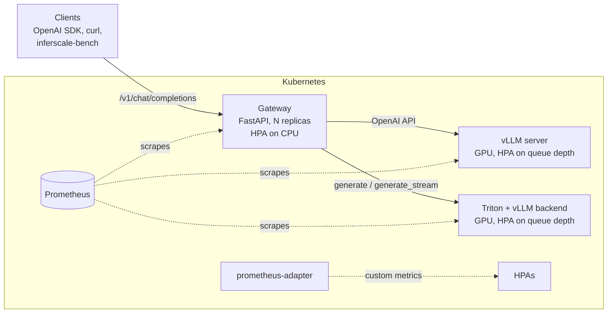

# InferScale

[](https://github.com/Markkoby3/llm-inference-k8s/actions/workflows/ci.yml)

Production-grade LLM serving on Kubernetes: an OpenAI-compatible gateway over
pluggable **vLLM** and **NVIDIA Triton Inference Server** backends, with Helm
deployment, GPU autoscaling, and a reproducible throughput and latency benchmark suite.

The question it answers: *with the model, GPU and engine held constant, what does
the serving layer cost?* Both backends run the same vLLM engine on the same weights,
so differences in throughput and tail latency come from the serving path itself.

## Architecture



Each request is routed by the `X-InferScale-Backend` header (or the configured
default). The gateway handles:

- **One API, two engines.** Translates OpenAI chat requests to vLLM's server and to Triton's
  generate extension, including streaming over server-sent events.
- **Identical inputs.** Renders the model's chat template for Triton, so both engines see
  byte-identical prompts.
- **Admission control.** Sheds load with `429 + Retry-After` instead of queueing until requests
  time out.
- **Honest errors.** Waits for the first token before committing to a `200`, so a dead engine
  returns a real `503`, not a broken stream.
- **Observability.** Prometheus metrics for time-to-first-token, latency, tokens and in-flight
  requests.

## Quickstart (no GPU needed)

The built-in mock backend simulates an engine's timing, so the full stack runs on a laptop.

```bash
pip install -e ".[dev]"
INFERSCALE_BACKENDS=mock python -m inferscale        # gateway on :8080
```

```bash
curl -s localhost:8080/v1/chat/completions -H 'Content-Type: application/json' -d '{
  "messages": [{"role": "user", "content": "Explain KV caching in one sentence."}],
  "max_tokens": 64, "stream": true
}'

inferscale-bench run --concurrency 1,8,32 --requests 100 --max-tokens 64
```

It works with the OpenAI SDK unchanged:

```python
from openai import OpenAI

client = OpenAI(base_url="http://localhost:8080/v1", api_key="unused")
reply = client.chat.completions.create(
    model="qwen2.5-1.5b-instruct",
    messages=[{"role": "user", "content": "Hello"}],
    extra_headers={"X-InferScale-Backend": "triton"},
)
```

## Deploy

| Target | Command |
|---|---|
| kind (CPU, mock backend) | `make kind-up kind-deploy` |
| One GPU (k3s, both engines time-sliced) | see [GPU runbook](docs/gpu-benchmark-runbook.md#path-b-k3s--helm) |
| GPU cluster (one GPU per engine) | `helm install inferscale deploy/helm/inferscale` |
| One GPU, no Kubernetes | `docker compose -f deploy/compose/docker-compose.gpu.yaml up -d` |

The chart deploys:

- The gateway, with an HPA, a PodDisruptionBudget, a non-root read-only container, and graceful
  stream draining.
- vLLM and Triton, with startup probes sized for weight downloads, a model cache and an enlarged
  `/dev/shm`.
- Optional queue-depth HPAs for the GPU engines ([autoscaling](docs/autoscaling.md)).
- Optional ServiceMonitors.

## Benchmarking

`inferscale-bench` sweeps concurrency levels and reports, per level:

- **Throughput:** output tokens per second and requests per second.
- **Time to first token (TTFT):** p50, p90, p95 and p99.
- **Time per output token (TPOT):** the inter-token latency once streaming starts.
- **End-to-end latency:** p50, p90, p95 and p99.
- **Errors:** failed requests out of the total sent.

It supports closed-loop load (fixed concurrency, finds peak throughput) and open-loop
Poisson arrivals (`--request-rate`, exposes queueing). Results are written as JSON, CSV and
Markdown, and `inferscale-bench compare` builds a side-by-side table.

Fairness rules (details in [design decisions](docs/design-decisions.md#3-benchmark-fairness-rules)):

- Same weights and memory budget for both engines.
- Identical prompt text.
- Fixed output length (`ignore_eos`) and greedy decoding.
- Distinct prompts, so the prefix cache cannot inflate results.
- Warmup requests before each level.
- Engines benchmarked one at a time.

### Results

> **In progress.** GPU benchmark runs (Qwen2.5-1.5B-Instruct, single NVIDIA GPU) are
> scheduled. They will be published here with the GPU model, date and raw data in
> `benchmarks/published/`. To reproduce them, follow the [GPU runbook](docs/gpu-benchmark-runbook.md).
> CI runs the harness end to end against the mock backend on every commit; those runs
> validate the pipeline and are not GPU performance numbers.

## Observability

| Metric | Type | Meaning |
|---|---|---|
| `inferscale_requests_total{backend,stream,status}` | counter | Requests by outcome (`499` = client disconnected mid-stream) |
| `inferscale_request_duration_seconds{backend,stream}` | histogram | End-to-end latency |
| `inferscale_time_to_first_token_seconds{backend}` | histogram | TTFT as seen by clients |
| `inferscale_completion_tokens_total{backend}` | counter | Generated tokens |
| `inferscale_inflight_requests` | gauge | Requests in progress on this pod |
| `inferscale_rejected_total` | counter | Requests shed with `429` |

The engines' own metrics (`vllm:*`, `nv_inference_*`) are scraped alongside these.

## Configuration

All gateway settings are environment variables. The Helm chart sets them from `values.yaml`.

| Variable | Default | Purpose |
|---|---|---|
| `INFERSCALE_BACKENDS` | `mock` | Comma-separated: `vllm`, `triton`, `mock` |
| `INFERSCALE_DEFAULT_BACKEND` | first listed | Used when no routing header is sent |
| `INFERSCALE_VLLM_URL` / `INFERSCALE_TRITON_URL` | in-cluster services | Engine endpoints |
| `INFERSCALE_TRITON_MODEL` | `llm` | Model name in Triton's repository |
| `INFERSCALE_TRITON_CHAT_TEMPLATE` | `chatml` | `chatml`, `llama3` or `plain`; must match the model |
| `INFERSCALE_MAX_INFLIGHT` | `256` | Admission limit per pod (`0` = unlimited) |
| `INFERSCALE_REQUEST_TIMEOUT_S` | `300` | Upstream timeout |

## Repository layout

```
src/inferscale/
  app.py             FastAPI app: routing, streaming, admission control, metrics
  backends/          Adapter interface + vLLM, Triton and mock adapters
  prompt.py          Chat templates for Triton
  stops.py           Streaming-safe stop-sequence filter
  bench/             Load generator, statistics, reports
deploy/
  helm/inferscale/   Helm chart and value profiles (default, single-gpu, mock)
  compose/           Docker Compose for a single GPU host
  gpu/               NVIDIA device-plugin time-slicing config
  kind/              Local cluster config
triton/              Triton model repository for Docker runs
docs/                Runbook, autoscaling, design decisions
tests/               Gateway, adapter, filter and harness tests (no GPU required)
```

## Development

```bash
make install   # editable install with dev tools
make check     # ruff, pytest, helm lint
```

CI runs on every push:

- Lint and tests on Python 3.11 and 3.12.
- `helm lint` and Kubernetes schema validation for every values profile.
- An end-to-end deploy to a kind cluster, with a smoke test and a short benchmark through the
  cluster.

## Roadmap

- [ ] Publish GPU benchmark results (vLLM vs. Triton, concurrency 1–64)
- [ ] Agentic RAG workflow: tool calling plus FAISS retrieval behind the gateway, with
      end-to-end latency of multi-step pipelines
- [ ] TensorRT-LLM backend for Triton as a separate engine-level comparison
- [ ] KV-cache-aware routing across engine replicas
- [ ] OpenTelemetry tracing from gateway to engine

## License

MIT
