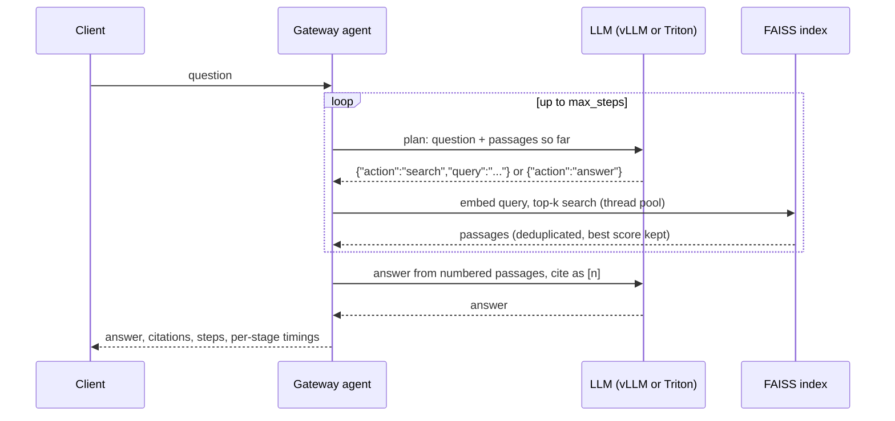

# Agentic RAG

`POST /v1/agent/chat` answers questions from a document set with a multi-step
agent: the model decides what to search for, a FAISS index returns passages, and
a final generation answers with inline citations. It runs through the same
gateway, admission control and backends as `/v1/chat/completions`, so the whole
pipeline can be served by vLLM or Triton and compared between them.

## How a request flows



## Request and response

```bash
curl -s localhost:8080/v1/agent/chat -H 'Content-Type: application/json' -d '{
  "messages": [{"role": "user", "content": "How can vLLM and Triton share one GPU?"}],
  "max_steps": 3, "top_k": 4
}'
```

```json
{
  "answer": "Enable device-plugin time-slicing so one GPU is advertised as two ... [1]",
  "citations": [
    {"index": 1, "source": "gpu-benchmark-runbook.md",
     "section": "2. Device plugin with time-slicing", "score": 0.31, "cited": true, "snippet": "..."}
  ],
  "steps": [
    {"action": "search", "query": "share one GPU time-slicing", "new_passages": 4,
     "plan_ms": 41.2, "retrieve_ms": 0.6},
    {"action": "answer", "query": null, "new_passages": 0, "plan_ms": 40.9, "retrieve_ms": 0.0}
  ],
  "timings_ms": {"plan": 82.1, "retrieve": 0.6, "generate": 230.4, "total": 313.5},
  "retrieval": {"chunks": 58, "sources": 6, "embedder": "hashing", "index": "faiss"}
}
```

Pick the serving engine with `X-InferScale-Backend: vllm | triton`, as for chat completions.

## Design

**Tool use as JSON in text.** Triton's generate endpoint has no tool-calling
API, so the planner replies with a JSON action in plain text. The agent extracts
the first JSON object that names an action, which tolerates models that add
chatter around it. The same prompts run on every backend, so the agent's latency
is comparable between engines.

**Graceful fallback.** If the plan is not valid JSON, the agent runs one search
with the user's question and answers: classic one-shot RAG instead of an error.
A repeated query also ends the loop, so a model that keeps asking the same thing
cannot burn steps.

**Retrieval off the event loop.** Embedding and search are CPU work, so they run
in a worker thread and never stall streaming responses on the same gateway pod.

**Exact search.** The corpus is small, so `IndexFlatIP` gives exact cosine
search with no approximate-recall loss in well under a millisecond. Without
FAISS installed, an equivalent NumPy index is used.

**Default embedder: hashed lexical features.** Unigrams and bigrams are hashed
into a 2,048-dimension vector, weighted by IDF fitted on the corpus, with light
suffix stemming. It needs no model download, keeps the gateway image small and
its filesystem read-only, and is deterministic for tests. Dense semantic
embeddings are available with `INFERSCALE_RAG_EMBEDDER=sentence-transformers`
and the `semantic` extra.

**Default corpus: this project's documentation.** The docs and README are
bundled into the package, so a fresh deployment can answer questions about its
own architecture and operations. Point `INFERSCALE_RAG_CORPUS` at any directory
of Markdown or text files to use your own.

## Retrieval quality

Measured offline on a labeled set of 24 questions written in different words
than the docs (`benchmarks/rag/questions.jsonl`). Each question names the file
and section that answers it; a hit counts when a retrieved chunk comes from that
section. Reproduce with `inferscale-bench retrieval`.

| Embedder | Recall@1 | Recall@3 | Recall@5 | MRR | Search p50 |
|---|---:|---:|---:|---:|---:|
| Hashing, no stemming | 0.58 | 0.79 | 0.79 | 0.67 | 0.07 ms |
| Hashing + stemming (default) | 0.71 | 0.88 | 0.88 | 0.79 | 0.07 ms |

Measured over the full bundled corpus (all docs plus the README, 58 chunks).
Caveats: 24 questions is a small, in-domain set, so treat differences of one or
two questions as noise. The test suite fails if recall@5 drops below 0.85 or MRR
below 0.7, so retrieval changes cannot silently regress it. Dense embeddings
(`sentence-transformers`) are the next comparison to run.

## Latency

`inferscale-bench agent` load-tests the endpoint and breaks latency down by
stage (plan, retrieve, generate). On the mock backend, retrieval is about 1 ms
of a roughly 370 ms request: the LLM calls dominate, and every planning step
adds a full model round trip. GPU numbers for vLLM and Triton will be published
with the main benchmark results.

```bash
inferscale-bench agent --backend vllm --concurrency 1,4,16 --requests 48
```

## Metrics

| Metric | Meaning |
|---|---|
| `inferscale_agent_steps{backend}` | Planning steps per request |
| `inferscale_agent_stage_seconds{backend,stage}` | Time in `plan`, `retrieve`, `generate` |
| `inferscale_requests_total{stream="agent"}` | Agent requests by outcome |

## Configuration

| Variable | Default | Purpose |
|---|---|---|
| `INFERSCALE_RAG_ENABLED` | `true` | Serve `/v1/agent/chat` |
| `INFERSCALE_RAG_CORPUS` | bundled docs | Directory or file of Markdown/text |
| `INFERSCALE_RAG_EMBEDDER` | `hashing` | or `sentence-transformers[:model]` |
| `INFERSCALE_RAG_INDEX` | `auto` | `faiss`, `numpy`, or `auto` |
| `INFERSCALE_RAG_MAX_STEPS` | `3` | Planning steps before answering |
| `INFERSCALE_RAG_TOP_K` | `4` | Passages per search |
